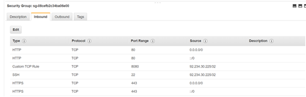
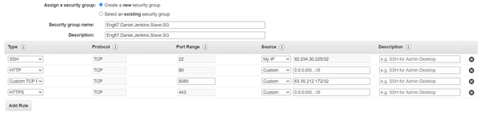
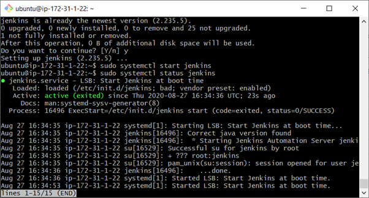
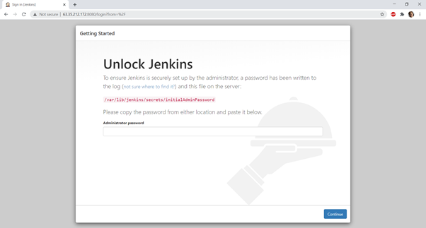

## Automating Pipeline With Containerisation
## Insalling Jenkins on a EC2 instance. 1212112

##### First we must spin up a EC2 intances on AWS (T2-Micro). This will be our main jenkins instance. Set the security group inbound rules as follows (We will make adjustments to this later.



##### Now We can spin up a 2nd EC2 instance. This will be the secondary Jenkins instance. Se the inbound rules as follows. (Agin we will make changes to this later)




##### Now we can SSH into the first main Instance (1st). Use the public IP address. This is where we will install Jenkins.


##### In order now paste these commands into the VM.
```
wget -q -O - https://pkg.jenkins.io/debian/jenkins-ci.org.key | sudo apt-key add –
```
```
echo deb https://pkg.jenkins.io/debian-stable binary/ | sudo tee /etc/apt/sources.list.d/jenkins.list
```
```
sudo apt-get update
```
```
sudo apt-get install Jenkins
```

##### If an error occurs when performing the last command you can try and paste the following command and then try reinstalling Jenkins

```
sudo apt install openjdk-8-jre
```
```
sudo apt-get update
```
```
sudo systemctl start Jenkins
```
##### Now lets see if Jenkins is running

```
sudo systemctl status Jenkins
```
##### It should say that Jenkins is active like below:



##### Now when you visit the main Instances public IP adress you should be able to access the following webpage. Note I was not able to access the page at first. I had to edit the inbound rules of the main Instance to allow for all tracffic on port 8080.



##### Now we need to get the Admin password. Go bac onto the git bash terminal and paste the following command:
```
cat /var/lib/jenkins/secrets/initialAdminPassword
```
##### Once pasted inside the terminal the password should appear as seen below:


##### Now go back to the Jenkins web page and enter in the password


##### From here now select Install suggested plugins


##### Now wait for it to install the plugins


##### You should be prompted to create a user like below. Enter the details that you would like to use and click save and continue


### Creating a Jenkins slave node

##### Creating another EC2 instance for a Jenkins slave node. First you want to create a folder called jenkins
```
sudo mkdir jenkins
sudo wget http://34.247.181.80:8080/jnlpJars/agent.jar
```
##### This will download a agent.jar file. Now we need to create a Jenkins user that we can switch too. 
```
sudo adduser jenkins
sudu su jenkins
```

### Creating a Docker instance

##### No we can create another instance to be used by Docker. To do this you can manually create a EC2 instance, ssh in and install the following  dependencies.
```
curl -fsSL https://download.docker.com/linux/
```
```
ubuntu/gpg | sudo apt-key add -
```
```
sudo add-apt-repository "deb [arch=amd64] 
```
```
https://download.docker.com/linux/ubuntu 
```
```
$(lsb_release -cs) stable"
```
```
sudo apt-get update
```
```
apt-cache policy docker-ce
```
```
sudo apt-get install -y docker-ce
```
```
sudo systemctl status docker
```

### Creating a continuous deloyment job

- Now that we have created an instance to hold our containers we can now automate the deployment phase with our CD pipeline job

- We must install docker pipeline plugin

- When creating the job, we want it to be triggered if our CI job is successful

### Adding your Docker credentials

- Click on the jenkins link found under 'stores scoped to jenkins'

- Click global credentials
- Then click add credentials on the left hand side
- We will then add the username, password and id (the string we will uses to reference that credential within the pipeline)

### Creating a Docker repo

- Before we create the pipeline we want to create a repo that we will send the image
- This can be done on docker hub
- On this instance we will call the repo ''jenkins-docker-pipeline-project''

### Script used for the pipeline
```
pipeline {
  environment {
    registry = "jenkins-docker-pipeline-project"
    registryCredential = 'dockerhub'
    dockerImage = ''
  }
  agent any
  stages {
    stage('Cloning Git') {
      steps {
        git 'https://github.com/DanTeegan/Automating_Pipeline_With_Containerisation-'
      }
    }
    // stage('Build') {
    //   steps {
    //      sh 'npm install'
    //   }
    // }
    // stage('Test') {
    //   steps {
    //     sh 'npm test'
    //   }
    // }
    stage('Building image') {
      steps{
        script {
          dockerImage = docker.build registry + ":$BUILD_NUMBER"
        }
      }
    }
    stage('Deploy Image') {
      steps{
         script {
            docker.withRegistry( '', registryCredential ) {
            dockerImage.push()
          }
        }
      }
    }
    stage('Remove Unused docker image') {
      steps{
        sh "docker rmi $registry:$BUILD_NUMBER"
      }
    }
  }
}
```

### Creating a googlescript DockerHub webhook to send emails
```
function doGet(e){
  return HtmlService.createHtmlOutput("request received");
}

function doPost(e) {
    var emailAddress = 'ENTER EMAIL HERE @ EMAIL.COM'
    var message = 'ENTER MESSAGE HERE '
    var subject = 'Sending Emails From Google Scripts';
    MailApp.sendEmail(emailAddress, subject, message);
    return HtmlService.createHtmlOutput()("post request received");
  
}
```